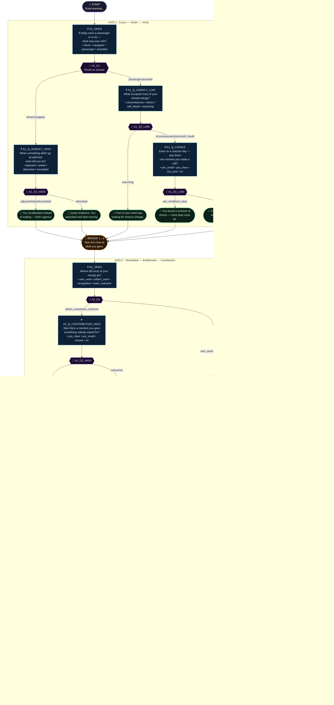

```mermaid
flowchart TD
    START([🌙 START\nGood evening...]) --> A1_OPEN

    %% ── AXIS 1 ──────────────────────────────────────────────────────────────
    subgraph AX1 ["AXIS 1 · Locus — Victim ↔ Victor"]
        A1_OPEN["❓ A1_OPEN\nIf today were a passenger in a car —\nwhat was your role?\n• driver • navigator • passenger • stranded"]
        A1_D1{{"🔀 A1_D1\nRoute on answer"}}
        A1_Q_AGENCY_HIGH["❓ A1_Q_AGENCY_HIGH\nWhen something didn't go as planned,\nwhat did you do?\n• adjusted • asked • absorbed • escalated"]
        A1_Q_AGENCY_LOW["❓ A1_Q_AGENCY_LOW\nWhat occupied most of your\nmental energy?\n• circumstances • others • self_doubt • searching"]
        A1_D2_HIGH{{"🔀 A1_D2_HIGH"}}
        A1_D2_LOW{{"🔀 A1_D2_LOW"}}
        A1_Q_CHOICE["❓ A1_Q_CHOICE\nEven on a reactive day — was there\none moment you made a call?\n• yes_small • yes_clear • not_sure • no"]
        A1_D3_LOW{{"🔀 A1_D3_LOW"}}
        A1_R_STRONG_INTERNAL(["💬 You recalibrated instead\nof waiting — that's agency."])
        A1_R_QUIET_INTERNAL(["💬 Quiet resilience. You\nabsorbed and kept moving."])
        A1_R_EMERGING_AGENCY(["💬 Part of your mind was\nlooking for what to change."])
        A1_R_DISCOVERED_AGENCY(["💬 You found a moment of\nchoice — more than most do."])
        A1_R_COMPASSIONATE_EXTERNAL(["💬 Honesty is awareness.\nAwareness is where agency begins."])
    end

    A1_OPEN --> A1_D1
    A1_D1 -->|"driver/navigator"| A1_Q_AGENCY_HIGH
    A1_D1 -->|"passenger/stranded"| A1_Q_AGENCY_LOW
    A1_Q_AGENCY_HIGH --> A1_D2_HIGH
    A1_D2_HIGH -->|"adjusted/asked/escalated"| A1_R_STRONG_INTERNAL
    A1_D2_HIGH -->|"absorbed"| A1_R_QUIET_INTERNAL
    A1_Q_AGENCY_LOW --> A1_D2_LOW
    A1_D2_LOW -->|"searching"| A1_R_EMERGING_AGENCY
    A1_D2_LOW -->|"circumstances/others/self_doubt"| A1_Q_CHOICE
    A1_Q_CHOICE --> A1_D3_LOW
    A1_D3_LOW -->|"yes_small/yes_clear"| A1_R_DISCOVERED_AGENCY
    A1_D3_LOW -->|"not_sure/no"| A1_R_COMPASSIONATE_EXTERNAL

    %% ── BRIDGE ───────────────────────────────────────────────────────────────
    A1_R_STRONG_INTERNAL --> BRIDGE_1_2
    A1_R_QUIET_INTERNAL --> BRIDGE_1_2
    A1_R_EMERGING_AGENCY --> BRIDGE_1_2
    A1_R_DISCOVERED_AGENCY --> BRIDGE_1_2
    A1_R_COMPASSIONATE_EXTERNAL --> BRIDGE_1_2

    BRIDGE_1_2(["🌉 BRIDGE 1→2\nNow let's look at\nwhat you gave."])

    %% ── AXIS 2 ──────────────────────────────────────────────────────────────
    subgraph AX2 ["AXIS 2 · Orientation — Entitlement ↔ Contribution"]
        A2_OPEN["❓ A2_OPEN\nWhere did most of your energy go?\n• own_work • others_work • recognition • team_outcome"]
        A2_D1{{"🔀 A2_D1"}}
        A2_Q_CONTRIBUTION_HIGH["❓ A2_Q_CONTRIBUTION_HIGH\nWas there a moment you gave\nsomething nobody asked for?\n• yes_clear • yes_small • unsure • no"]
        A2_Q_ENTITLEMENT_PROBE["❓ A2_Q_ENTITLEMENT_PROBE\nWhen you think about your team today,\nwhat's the dominant feeling?\n• satisfied • undervalued • disconnected • frustrated_others"]
        A2_D2_HIGH{{"🔀 A2_D2_HIGH"}}
        A2_D2_LOW{{"🔀 A2_D2_LOW"}}
        A2_Q_WHAT_COUNTS["❓ A2_Q_WHAT_COUNTS\nWhich of these happened today?\n• listened • covered • acknowledged • none"]
        A2_D3{{"🔀 A2_D3"}}
        A2_R_STRONG_CONTRIBUTION(["💬 Discretionary effort.\nIt registered."])
        A2_R_NEUTRAL_REFRAME(["💬 When did you last give\nto something beyond your metrics?"])
        A2_R_ENTITLEMENT_MIRROR(["💬 What we focus on shapes\nwhat we can see."])
        A2_R_HIDDEN_CONTRIBUTION(["💬 That's contribution —\neven if it doesn't feel like it."])
        A2_R_HONEST_LOW_CONTRIBUTION(["💬 Some days, survival mode\nis the mode. Notice the pattern."])
    end

    BRIDGE_1_2 --> A2_OPEN
    A2_OPEN --> A2_D1
    A2_D1 -->|"others_work/team_outcome"| A2_Q_CONTRIBUTION_HIGH
    A2_D1 -->|"own_work/recognition"| A2_Q_ENTITLEMENT_PROBE
    A2_Q_CONTRIBUTION_HIGH --> A2_D2_HIGH
    A2_D2_HIGH -->|"yes_clear/yes_small"| A2_R_STRONG_CONTRIBUTION
    A2_D2_HIGH -->|"unsure/no"| A2_Q_WHAT_COUNTS
    A2_Q_ENTITLEMENT_PROBE --> A2_D2_LOW
    A2_D2_LOW -->|"satisfied/disconnected"| A2_R_NEUTRAL_REFRAME
    A2_D2_LOW -->|"undervalued/frustrated_others"| A2_R_ENTITLEMENT_MIRROR
    A2_Q_WHAT_COUNTS --> A2_D3
    A2_D3 -->|"listened/covered/acknowledged"| A2_R_HIDDEN_CONTRIBUTION
    A2_D3 -->|"none"| A2_R_HONEST_LOW_CONTRIBUTION

    %% ── BRIDGE ───────────────────────────────────────────────────────────────
    A2_R_STRONG_CONTRIBUTION --> BRIDGE_2_3
    A2_R_NEUTRAL_REFRAME --> BRIDGE_2_3
    A2_R_ENTITLEMENT_MIRROR --> BRIDGE_2_3
    A2_R_HIDDEN_CONTRIBUTION --> BRIDGE_2_3
    A2_R_HONEST_Low_CONTRIBUTION --> BRIDGE_2_3

    BRIDGE_2_3(["🌉 BRIDGE 2→3\nNot just what you did —\nbut who was in your field of view."])

    %% ── AXIS 3 ──────────────────────────────────────────────────────────────
    subgraph AX3 ["AXIS 3 · Radius — Self-Centric ↔ Altrocentric"]
        A3_OPEN["❓ A3_OPEN\nWho else is in the frame\nof today's biggest challenge?\n• just_me • my_team • specific_colleague • end_user"]
        A3_D1{{"🔀 A3_D1"}}
        A3_Q_SELF_PROBE["❓ A3_Q_SELF_PROBE\nWas anyone nearby watching\nor depending on how you handled it?\n• yes_noticed • yes_after • maybe • no"]
        A3_Q_TEAM_DEPTH["❓ A3_Q_TEAM_DEPTH\nDid you notice how a teammate\nwas doing beyond the task?\n• yes_checked • somewhat • task_only • no_bandwidth"]
        A3_Q_ALTROCENTRIC_DEPTH["❓ A3_Q_ALTROCENTRIC_DEPTH\nDid that awareness\nchange how you acted?\n• yes_acted • yes_internal • not_sure • no_change"]
        A3_D2_SELF{{"🔀 A3_D2_SELF"}}
        A3_D2_TEAM{{"🔀 A3_D2_TEAM"}}
        A3_D2_ALTO{{"🔀 A3_D2_ALTO"}}
        A3_R_STRONG_ALTROCENTRIC(["💬 Self-transcendence:\nexpansion of what you're working for."])
        A3_R_EXPANDING_RADIUS(["💬 Under stress, you still\nheld others in your awareness."])
        A3_R_PARTIAL_RADIUS(["💬 Perspective-taking goes\nbeyond tracking — to feeling."])
        A3_R_NARROW_RADIUS(["💬 Tomorrow: name one person\nyou'll pay attention to."])
        A3_R_AWARENESS_SEED(["💬 Awareness is where\nchange begins."])
    end

    BRIDGE_2_3 --> A3_OPEN
    A3_OPEN --> A3_D1
    A3_D1 -->|"just_me"| A3_Q_SELF_PROBE
    A3_D1 -->|"my_team"| A3_Q_TEAM_DEPTH
    A3_D1 -->|"specific_colleague/end_user"| A3_Q_ALTROCENTRIC_DEPTH
    A3_Q_SELF_PROBE --> A3_D2_SELF
    A3_D2_SELF -->|"yes_noticed/yes_after"| A3_R_EXPANDING_RADIUS
    A3_D2_SELF -->|"maybe/no"| A3_R_NARROW_RADIUS
    A3_Q_TEAM_DEPTH --> A3_D2_TEAM
    A3_D2_TEAM -->|"yes_checked"| A3_R_STRONG_ALTROCENTRIC
    A3_D2_TEAM -->|"somewhat/task_only/no_bandwidth"| A3_R_PARTIAL_RADIUS
    A3_Q_ALTROCENTRIC_DEPTH --> A3_D2_ALTO
    A3_D2_ALTO -->|"yes_acted/yes_internal"| A3_R_STRONG_ALTROCENTRIC
    A3_D2_ALTO -->|"not_sure/no_change"| A3_R_AWARENESS_SEED

    %% ── SUMMARY & END ────────────────────────────────────────────────────────
    A3_R_STRONG_ALTROCENTRIC --> SUMMARY_NODE
    A3_R_EXPANDING_RADIUS --> SUMMARY_NODE
    A3_R_PARTIAL_RADIUS --> SUMMARY_NODE
    A3_R_NARROW_RADIUS --> SUMMARY_NODE
    A3_R_AWARENESS_SEED --> SUMMARY_NODE

    SUMMARY_NODE(["📋 SUMMARY\nLocus · Orientation · Radius\nPersonalized reflection synthesis"])
    END([✨ END\nSee you tomorrow evening.])

    SUMMARY_NODE --> END

    %% ── Styling ──────────────────────────────────────────────────────────────
    classDef startEnd fill:#1a1a2e,stroke:#7c6af7,color:#fff,rx:20
    classDef question fill:#0d2137,stroke:#4ea8de,color:#e0f0ff
    classDef decision fill:#1a0d2e,stroke:#9b5cf6,color:#e8d5ff
    classDef reflection fill:#0d2118,stroke:#3ecf8e,color:#d0f5e8
    classDef bridge fill:#2e1a0d,stroke:#f59e0b,color:#fef3c7
    classDef summaryEnd fill:#1a1a1a,stroke:#f59e0b,color:#fef9c3

    class START,END startEnd
    class A1_OPEN,A1_Q_AGENCY_HIGH,A1_Q_AGENCY_LOW,A1_Q_CHOICE question
    class A2_OPEN,A2_Q_CONTRIBUTION_HIGH,A2_Q_ENTITLEMENT_PROBE,A2_Q_WHAT_COUNTS question
    class A3_OPEN,A3_Q_SELF_PROBE,A3_Q_TEAM_DEPTH,A3_Q_ALTROCENTRIC_DEPTH question
    class A1_D1,A1_D2_HIGH,A1_D2_LOW,A1_D3_LOW decision
    class A2_D1,A2_D2_HIGH,A2_D2_LOW,A2_D3 decision
    class A3_D1,A3_D2_SELF,A3_D2_TEAM,A3_D2_ALTO decision
    class A1_R_STRONG_INTERNAL,A1_R_QUIET_INTERNAL,A1_R_EMERGING_AGENCY reflection
    class A1_R_DISCOVERED_AGENCY,A1_R_COMPASSIONATE_EXTERNAL reflection
    class A2_R_STRONG_CONTRIBUTION,A2_R_NEUTRAL_REFRAME,A2_R_ENTITLEMENT_MIRROR reflection
    class A2_R_HIDDEN_CONTRIBUTION,A2_R_HONEST_LOW_CONTRIBUTION reflection
    class A3_R_STRONG_ALTROCENTRIC,A3_R_EXPANDING_RADIUS,A3_R_PARTIAL_RADIUS reflection
    class A3_R_NARROW_RADIUS,A3_R_AWARENESS_SEED reflection
    class BRIDGE_1_2,BRIDGE_2_3 bridge
    class SUMMARY_NODE summaryEnd
```
